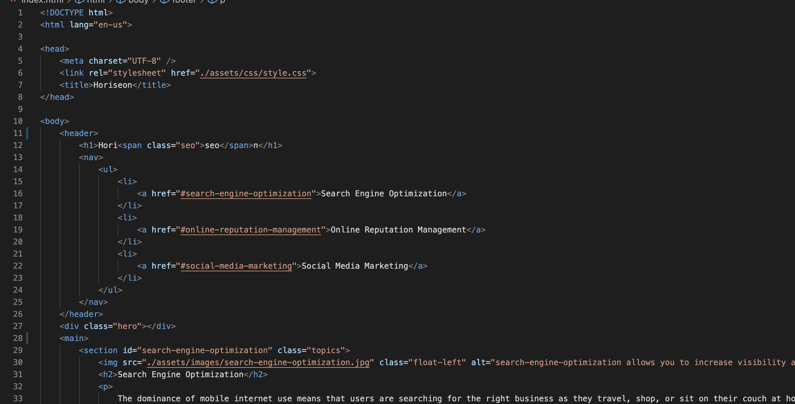
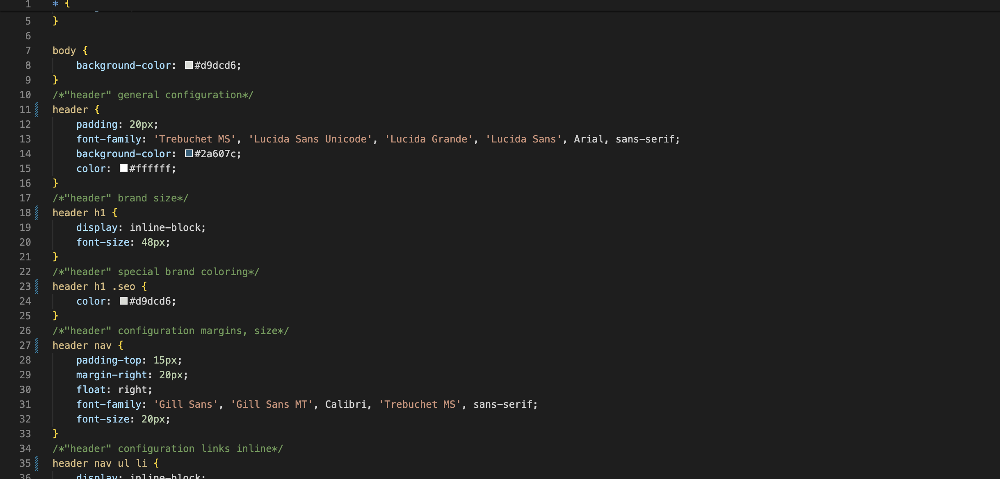

# 01_HTML_CSS_Git_CodeRefactor

## Description

- The motivation of the project was to improve the structure of the HTMl and CSS as well as to remove some bugs. 
- The website was not functioning properly and the code unstructured and clunky
- The imnprovements fixed the links and the title of the page. The code is now leaner and the elements follow the regulations.
- I learned how to navigate better within github, I had to get a better understanding of the HTML elements and their meaning/usage, I had to learn the functions of the css classes.

## Usage

The website has links that take you to the subjects below. In the images below I also show part of the code modifications that have been made.

## Credits

The code used in this repo was provided and is part of a bootcamp from Columbia University. The code was only modified.

The following websites were used for the assignment:

https://developer.mozilla.org/en-US/docs/Web/HTML/Element

https://www.w3schools.com/html/html_attributes.asp

## Features

Links in the header of the website will take you to the subjects below
Test it out, here is the website link:

https://flo2009.github.io/01_HTML_CSS_Git_CodeRefactor/

